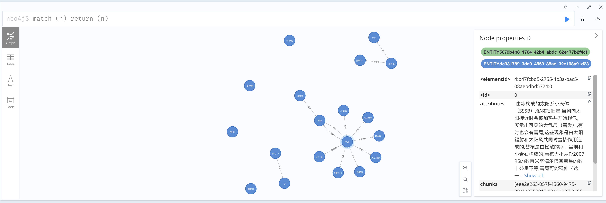

# WeKnora 知识图谱

## 快速开始

- .env 配置相关环境变量
    - 启用 Neo4j: `NEO4J_ENABLE=true`
    - Neo4j URI: `NEO4J_URI=bolt://neo4j:7687`
    - Neo4j 用户名: `NEO4J_USERNAME=neo4j`
    - Neo4j 密码: `NEO4J_PASSWORD=password`

- 启动 Neo4j
```bash
docker-compose --profile neo4j up -d
```

- 在知识库设置页面启用实体和关系提取，并根据提示配置相关内容

## 生成图谱

上传任意文档后，系统会自动提取实体和关系，并生成对应的知识图谱。



## 查看图谱

登陆 `http://localhost:7474`，执行 `match (n) return (n)` 即可查看生成的知识图谱。

在对话时，系统会自动查询知识图谱，并获取相关知识。
