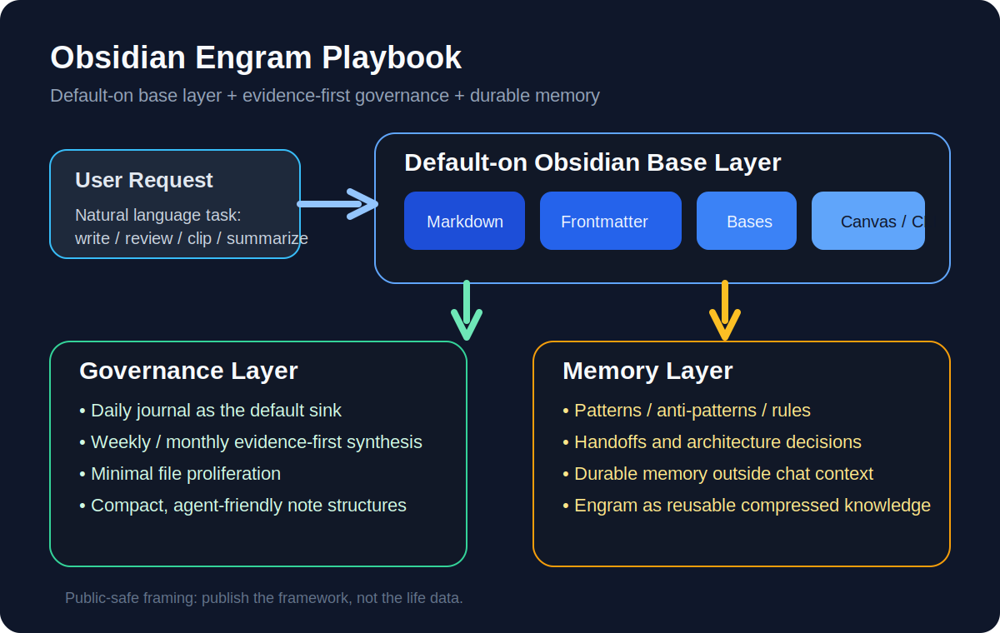
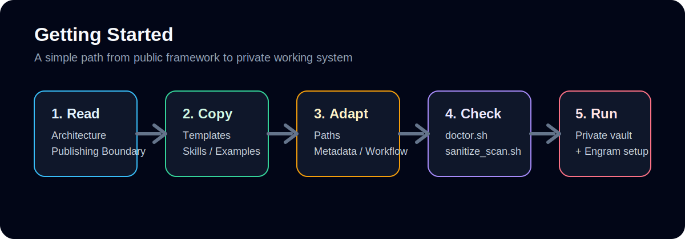

<h1 align="center">Obsidian Engram Playbook</h1>

<p align="center"><strong>面向 Obsidian + LLM Agents 的 Engram-first 知识治理框架</strong></p>

<p align="center">
  一个可公开分享、已脱敏的框架仓库，用于把 Obsidian、Engram 和记忆/复盘工作流组织成可长期运行的系统。
</p>

<p align="center">
  <a href="https://github.com/watsonk1998/obsidian-engram-playbook/actions/workflows/repo-checks.yml">
    
  </a>
  <a href="https://github.com/watsonk1998/obsidian-engram-playbook/releases">
    
  </a>
</p>

<p align="center">
  <strong>语言：</strong><a href="README.md">English</a> · 简体中文
</p>

<p align="center">
  <sub>公开的是 framework，不是 life data。</sub>
</p>

## 这个项目为什么存在

很多 Obsidian 项目关注的是：

- 插件清单
- 美化主题
- 笔记技巧

这个项目关注的是另一件事：

- 如何让 **Obsidian 变成真正可工作的操作界面**
- 如何让 **记忆不依赖单个聊天窗口**
- 如何让 **LLM Agent 在 vault 内工作但不制造混乱**
- 如何用 **日记 / 周报 / 月报** 形成稳定的复盘节奏

这个仓库是一个 **playbook / framework**，不是私人 vault 导出。

## 这个仓库包含什么

它提供了一套可复用的方法，用来组合：

- **Obsidian**：作为工作知识表层
- **Engram**：作为可复用的长期记忆层
- **LLM Agents**：作为写作、整理、综合与维护的执行者
- **日 / 周 / 月复盘**：作为主要治理节奏

## 架构总览

<p align="center">
  
</p>
<p align="center">
  <sub>三层结构：默认生效的 Obsidian 基础层、治理层、以及 Engram 记忆层。</sub>
</p>

## 核心原则

### 1. Obsidian 基础层默认生效

用户不应该记一堆工具名。

当任务涉及 Obsidian 内容时，Agent 应自动接入正确的基础能力：

- `obsidian-markdown` 处理 `.md`
- `obsidian-engram-frontmatter` 处理元数据
- `obsidian-bases` 处理 `.base`
- `json-canvas` 处理 `.canvas`
- `defuddle` 处理网页剪藏
- `obsidian-cli` 处理 vault / 插件自动化

### 2. Engram-first 记忆模型

可复用的经验、规则、交接、模式，进入 Engram。  
Obsidian 继续承担“可读、可回顾、可导航”的工作表层。

### 3. Evidence-first 写作

笔记、周报、月报、总结，应尽量基于：

- 源笔记
- 链接证据
- 改动文件
- 用户明确提供的事实

如果证据不足，就明确写出来。

### 4. 最小文件增殖

不要为了“看起来结构化”就疯狂创建文件。

优先：

- 用日记承接日常证据
- 用周报/月报做周期综合
- 用 Engram 保存可复用知识
- 只有在确实有长期价值时才新建独立笔记

## 适合谁

如果你想把下面这些组合起来，这个仓库可能对你有帮助：

- 把 Obsidian 当成严肃工作环境
- 把 AI Agent 当成知识操作员
- 建立周期复盘工作流
- 把长期记忆从单次聊天里剥离出来

## 快速开始

1. 先读 `docs/architecture.md`
2. 再看 `docs/publishing-boundary.md`
3. 从 `templates/` 拷贝模板
4. 看 `skills/` 下的脱敏 skill 示例
5. 运行 `scripts/doctor.sh`
6. 任何公开分享前先运行 `scripts/sanitize_scan.sh`

## 上手流程图

<p align="center">
  
</p>
<p align="center">
  <sub>阅读 → 复制 → 适配 → 检查 → 在你的私有 vault 与记忆系统中运行。</sub>
</p>

## 仓库结构

```text
docs/        架构、治理、发布边界、脱敏说明
templates/   可复用模板（笔记 / 报告 / Base / Canvas）
skills/      面向 Agent 的脱敏 skill 示例
scripts/     通用维护脚本与脱敏扫描脚本
examples/    安全示例 vault 骨架与示例笔记
assets/      可公开的图示或截图
```

## 它不包含什么

这个公开仓库**不会**包含：

- 真实日记
- 真实周报 / 月报
- 真实 Engram 记忆
- 私有 MCP 配置
- 密钥 / token / API key
- 雇主 / 客户 / 项目敏感信息
- 真实机器上的绝对路径

## 发布边界

如果你想基于这个仓库公开自己的版本，请重点检查：

- 绝对路径
- 人名 / 公司 / 项目名
- 截图和附件
- 元数据字段
- 硬编码脚本
- git 历史

参考：

- `docs/sanitization-checklist.md`
- `docs/publishing-boundary.md`
- `SECURITY.md`

## Changelog

见 `CHANGELOG.md`。

## 建议使用方式

1. 把模板复制到你自己的 vault
2. 把占位路径替换成你的本地路径
3. 按你的工作流调整 frontmatter 规则
4. 把私有笔记和记忆系统留在公开仓库之外
5. 把这个 repo 当作 framework，而不是 vault 快照

## 路线图

当前还是早期公开版本，优先保证清晰、安全、可复用，而不是一次性做全。

### 近期
- [ ] 增加更多脱敏示例
- [ ] 增加一个公开安全的 MOC / 导航示例
- [ ] 增加更清晰的 review / memory flow 图
- [ ] 增加参数化安装 / bootstrap 指南

### 中期
- [ ] 增加多 Agent 使用示例
- [ ] 增加更完整的 `.base` 和 `.canvas` 示例
- [ ] 增加从 graph-heavy vault 迁移到 Engram-first 的说明
- [ ] 增加 CI 级别的基础脱敏 / 发布检查

### 长期
- [ ] 发布一个更完整的 demo vault
- [ ] 增加对更多 agent runtime 的适配
- [ ] 逐步发展成一个更完整的公共 starter kit

## 参与贡献

欢迎贡献，但这个仓库是**有明显治理边界和方法偏好的**。

请先阅读 `CONTRIBUTING.md`。  
尤其注意：

- 保持示例脱敏
- 保持脚本通用
- 不要引入私有 vault 假设
- 提交前先跑本地安全检查

## License

除特别说明外，文档、模板和脚本使用 MIT License。
